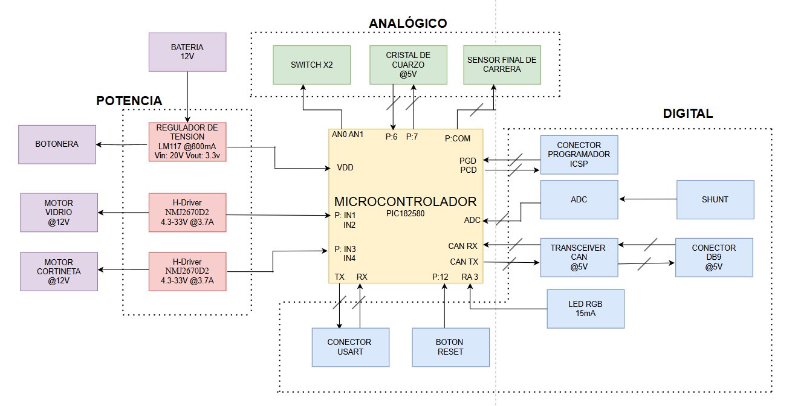

## Dijous_Techo-Solar_MarcBaillo_MiguelangelMolina
Proyecto de Herramientas de Diseño del Techo Solar (Jueves).

# Autores
- Miguelangel Molina(@MiaMoSaN)
- Marc Baillo (@MarcBaillo)

## Objectivos del proyecto

El objetivo que tenemos es conseguir diseñar un techo solar que estara formado por un microcontrolador, 2 motores que controlaran la apertura con final de carrera y el movimiento de la cortina, un sensor que evite atrapamientos y una luz ambiental producida por un LED RGB. Todo esto estara implementado en una PCB, pasando por las fases de diagrama de bloque, que luego pasar al esquematico y alfinal al layout, para luego evaluarlo y hacer unos presupuestos de cuanto valdra crear la placa.

## Requisitos i especificaciones:

- Diseño integral de un techo solar controlado por microcontrolador.
- Implementación de un motor de apertura con final de carrera.
- Integración de un motor de la cortina.
- Luz ambiental RGB.
- Integración de un sensor digital para evitar que atrapamientos.

## Diagrama de bloque

## Tabla de componentes
| Descripción        | Manufacturer Number     | Descripción | Datasheet          | Proveidor        | Unidades       | Precio Unitario + Impuestos |
|:----------------:|:-------------------------:|:----------------:|:---------------:|:--------------:|:--------------:|:--------------:|
| Microcontrolador | PIC18LF2580-I/SO | Procesador que actúa como cerebro de control del circuito | [Datasheet](https://ww1.microchip.com/downloads/aemDocuments/documents/OTH/ProductDocuments/DataSheets/39637d.pdf) | DigiKey | 1 | 9,2€ |
| Regulador de tensión | LM1117DT-3.3/NOPB  | Dispositivo que hace que la tensión de entrada pase de 12V a los que necesita el microcontrolador (3,3V) | [Datasheet](https://www.ti.com/lit/ds/symlink/lm1117.pdf?ts=1710745623625&ref_url=https%253A%252F%252Fwww.mouser.se%252F) | Mouser Electronics | 1 | 1,61€ |
| Conector | DB9  | Se ocupa de la conexión entre diferentes dispositivos |[Datasheet](https://www.mouser.es/datasheet/2/18/1/Cable_Glands_and_Cord_Grips-806485.pdf) | Mouser Electronics | 1 | 19,08€ |
| Oscilador | ECS-80-8-30-JGN-TR | Genera ondas de señales precisas| [Datasheet](https://www.mouser.es/datasheet/2/122/ecx_53r-1775695.pdf) | Mouser Electronics | 1 | 0,53€ |
| H-Driver | DRV8231ADDAR  | controla el sentido de giro de un motor | [Datasheet](https://www.ti.com/lit/ds/symlink/drv8231a.pdf?ts=1710753914026&ref_url=https%253A%252F%252Fwww.mouser.de%252F) | Mouser Electronics | 1 | 1,24€ |
| Transceiver | 	TCAN332DR  | Dispositivo que recibe y trtransmite datos |[Datasheet](https://www.ti.com/lit/ds/symlink/tcan332g.pdf?ts=1710924087476&ref_url=https%253A%252F%252Fwww.mouser.de%252F) | DigiKey | 1 | 2,83€ |
| LED RGB | LB Q39G-N1OO-35-1-5-R18  | LED que da luz ambiental al coche |[Datasheet](https://look.ams-osram.com/m/6e36864d019f51d4/original/LB-Q39G.pdf) | DigiKey | 1 | 0,2€ |
| Motor | D4387-12-ME  | Motores para poder abrir y cerrar el cristal o la cortina del techo | [Datasheet](https://transmotec.es/Download/Catalog/Transmotec-EN-DC-12W-450W-2022.pdf) | Transmotec | 2 | 345€ |
| Switch | SS-01GPD  | Dispositivos que controlan cuando es el final de carrera | [Datasheet](https://www.mouser.es/datasheet/2/307/en_ss-1509069.pdf) | Mouser Electronics | 1 | 1,27€ |
| Pulsador | MPB01-1B00-S-D  | Dispositivo que permite controlar el motor para que el techo o cortina se abra o se cierre  | [Datasheet](https://www.mouser.es/datasheet/2/670/mpb01-2474754.pdf) | Mouser Electronics | 2 | 3,14€ |
| Conector | ICSP  | Sirve para comunicarse con el exterior para programar el microcontrolador | [Datasheet](https://ww1.microchip.com/downloads/en/DeviceDoc/30277d.pdf) | DigiKey | 2 | 1,52€ |

## Historial de canvis 

| Data | Autor | Descripció |
|:------:|:------:|:------------:|
| 20-03-2025 | Marc y Miguel | Creado el proyecto y escogido el diseño que se trabajara (Techo Solar) |
| 20-03-2025 | Marc y Miguel | Elección de componentes y presentación del proyecto (Sesión 1) |
| 20-03-2025 | Marc y Miguel | Creación de Diagrama de Bloque |
| 23-03-2025 | Marc | Cadlab y GitHub creado |
| 24-03-2025 | Miguel | Creación del Esquematico |
| 25-03-2025 | Marc | Simulaciones hechas |
| 26-03-2025 | Miguel | Modificación Diagrama de Bloque |
| 27-03-2025 | Marc | Creació del README |
| 27-03-2025 | Marc y Miguel | Modificación presentación proyecto (Sesión 2) |
| 31-03-2025 | Miguel | Creación Layout |

